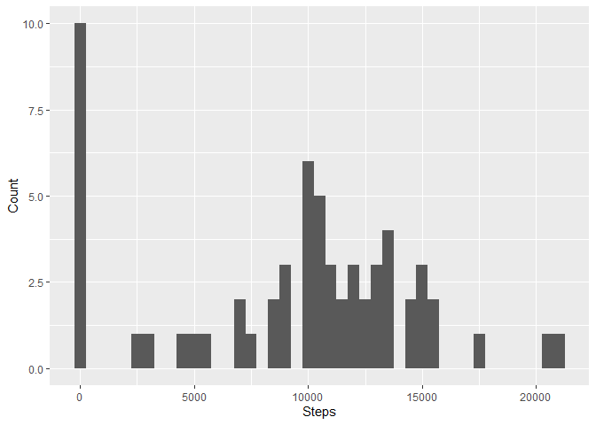
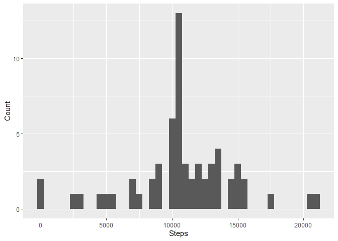
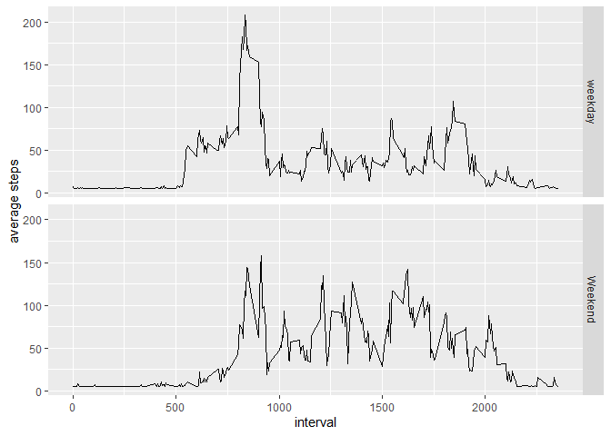

## Loading and preprocessing the data

```r
unzip("activity.zip")
data <- read.csv("activity.csv",header = T)
```


## What is mean total number of steps taken per day?

```r
library(data.table)
library(ggplot2)
data_dt <- as.data.table(data)
total_per_day <- data_dt[,.(total = sum(steps,na.rm = T)),by =date]
qplot(total_per_day$total,xlab = "Steps",ylab = "Count",binwidth = 500)
```

<!-- -->

```r
TotalMean <- mean(data_dt$steps,na.rm = T)
TotalMedian <- median(data_dt$steps,na.rm = T)
```
 Mean: 37.3825996
 Median: 0


## What is the average daily activity pattern?

```r
avg_per_interval <- data_dt[,.(avg_steps=mean(steps,na.rm = T)),by = interval]
ggplot(data = avg_per_interval,aes(x=interval,y=avg_steps))+
  geom_line() + 
  xlab("5-minute interval")+
  ylab("average number of steps taken")
```

<!-- -->

```r
max_interval <- avg_per_interval[which.max(avg_steps),interval]
```
835 contains number of steps  across all the days
 


## Imputing missing values

```r
total_NAs <- data_dt[!complete.cases(data_dt),.N]

data_complete <- data_dt[which(!complete.cases(data_dt)),steps:=mean(data_dt$steps,na.rm = T)]

total_per_day <- data_complete[,.(total = sum(steps,na.rm = T)),by =date]
qplot(total_per_day$total,xlab = "Steps",ylab = "Count",binwidth = 500)
```

<!-- -->

```r
TotalMean <- mean(data_complete$steps,na.rm = T)
TotalMedian <- median(data_complete$steps,na.rm = T)
```
* Number of missing values 2304
* Mean (Imputed): 37.3324226
* Median (Imputed):  0


## Are there differences in activity patterns between weekdays and weekends?


```r
library(lubridate)
data_complete[,wdays := ifelse(wday(date)%in%c(1,7),"Weekend","weekday")]
data_complete$wdays <- as.factor(data_complete$wdays)
avg_per_interval <- data_complete[,.(avg = mean(steps)),by=.(interval,wdays)]

ggplot(data = avg_per_interval,aes(x=interval,y=avg)) + geom_line()+
  facet_grid(wdays~.)+ ylab("average steps")+xlab("interval")
```

<!-- -->

